# MGMERL Digital Assistant
## Intelligent Digital Assistant for Strengthening UNICEF WASH Monitoring & Evaluation

---

## Overview

**EN:**  
This project focuses on the design and development of an intelligent digital assistant aimed at strengthening the use of the MGMERL national monitoring and evaluation system within the UNICEF WASH Madagascar program. The assistant was designed to simplify access to information, improve user understanding of the system, and support training and self-learning for all categories of MGMERL users.

**FR :**  
Ce projet porte sur la conception et le développement d’un assistant numérique intelligent visant à renforcer l’utilisation du système national de suivi-évaluation MGMERL au sein du programme UNICEF WASH Madagascar. L’assistant a été conçu pour simplifier l’accès à l’information, améliorer la compréhension du système et accompagner la formation ainsi que l’auto-apprentissage de l’ensemble des utilisateurs de MGMERL.

---

## Project Objectives

**EN:**  
- Improve accessibility and understanding of MGMERL resources  
- Support daily usage of the system by diverse user profiles  
- Enable guided learning and user autonomy  
- Ensure up-to-date and reliable information through automated data pipelines  

**FR :**  
- Améliorer l’accessibilité et la compréhension des ressources MGMERL  
- Accompagner l’utilisation quotidienne du système par des profils utilisateurs variés  
- Favoriser l’apprentissage guidé et l’autonomie des utilisateurs  
- Garantir la fiabilité et l’actualisation des informations grâce à des pipelines automatisés  

---

## Scope and Users

**EN:**  
The assistant targets all categories of MGMERL users, including internal UNICEF staff, implementation partners, government teams, and field data collectors. It is designed as a complementary module to the existing system, without requiring direct access to MGMERL internal code or databases.

**FR :**  
L’assistant s’adresse à toutes les catégories d’utilisateurs de MGMERL, notamment le personnel interne de l’UNICEF, les partenaires de mise en œuvre, les équipes gouvernementales et les collecteurs de données sur le terrain. Il a été conçu comme un module complémentaire au système existant, sans accès direct au code ni aux bases de données internes de MGMERL.

---

## Core Features

**EN:**  
- Centralization of official MGMERL documents, forms, guides, and resources  
- Contextualized answers generated through a Retrieval-Augmented Generation (RAG) approach  
- Direct references to official source documents  
- Guided explanations to support training and self-learning  
- Automated content updates via scheduled data workflows  
- User interaction tracking through analytics dashboards  

**FR :**  
- Centralisation des documents officiels, formulaires, guides et ressources MGMERL  
- Génération de réponses contextualisées via une approche Retrieval-Augmented Generation (RAG)  
- Références directes vers les ressources officielles  
- Explications guidées pour la formation et l’auto-apprentissage  
- Mise à jour automatique des contenus grâce à des workflows planifiés  
- Suivi des interactions utilisateurs via des tableaux de bord analytiques  

---

### Monitoring and Analytics

**EN:**  
Google Analytics dashboards are integrated to monitor user behavior, measure usage patterns, and provide visibility into how the system is adopted and used across different user profiles.

**FR :**  
Des tableaux de bord Google Analytics sont intégrés afin de suivre le comportement des utilisateurs, analyser les usages et offrir une visibilité sur l’adoption du système par les différents profils.

<table align="center">
  <tr>
    <td align="center">
      
       
      Conversation interface – Navigating system resources / Interface de conversation – Navigation dans les ressources du système
    </td>
    
  </tr>
  <tr>
    <td align="center">
      
       
      Conversation interface – System training and learning / Interface de conversation – Formation et apprentissage du système
    </td>
  </tr>
  <tr>
    <td align="center">
      
       
      Interface – Visualization of interaction reports / Interface – Visualisation des rapports d’interaction
    </td>
  </tr>
</table>

---

## Technical Architecture

**EN:**  
The solution relies on a modular and scalable architecture combining a web application, a data lake, automated ETL workflows, and a vector-based semantic search engine.

Key components include:
- A FastAPI backend exposing secure APIs  
- A React frontend providing an intuitive user interface  
- A Data Lake based on HDFS, Hive, and Spark for data storage and transformation  
- Automated workflows orchestrated with n8n  
- A Milvus vector database for semantic search  
- Integration of LLMs within a RAG pipeline  

**FR :**  
La solution repose sur une architecture modulaire et évolutive combinant une application web, un data lake, des workflows ETL automatisés et un moteur de recherche sémantique vectoriel.

Les composants clés incluent :
- Un backend FastAPI exposant des API sécurisées  
- Un frontend React offrant une interface utilisateur intuitive  
- Un Data Lake basé sur HDFS, Hive et Spark pour le stockage et la transformation des données  
- Des workflows automatisés orchestrés avec n8n  
- Une base de données vectorielle Milvus pour la recherche sémantique  
- L’intégration de LLMs dans un pipeline RAG  

<table align="center">
  <tr>
    <td align="center">
      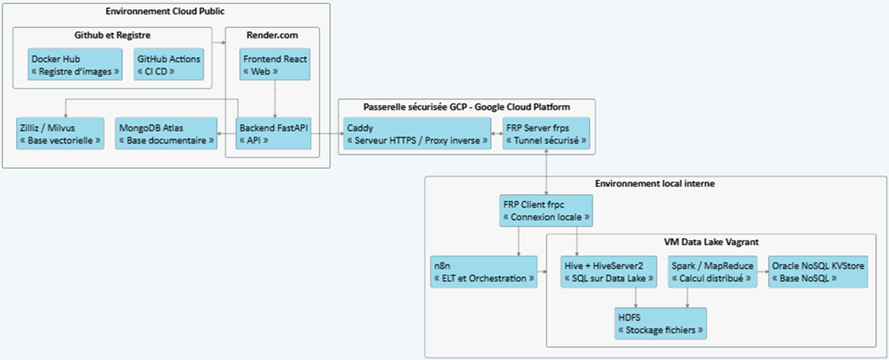
       
      Project architecture / Architecture du projet
    </td>
  </tr>
</table>

<table align="center">
  <tr>
    <td align="center"></td>
    <td align="center"></td>
    <td align="center"></td>
  </tr>
  <tr>
    <td align="center"></td>
    <td align="center"></td>
    <td align="center">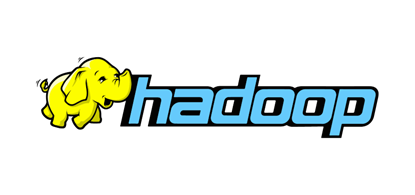</td>
  </tr>
  <tr>
    <td colspan="3" align="center">Technologies used / Technologies utilisées</td>
  </tr>
</table>

<table align="center">
  <tr>
    <td align="center">
      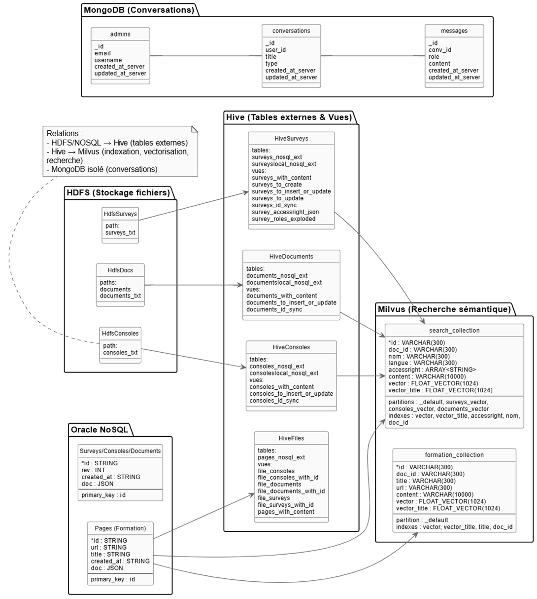
       
      Diagram of database architecture and storage systems / Diagramme de l’architecture des bases de données et systèmes de stockage
    </td>
    
  </tr>
  <tr>
    <td align="center">
      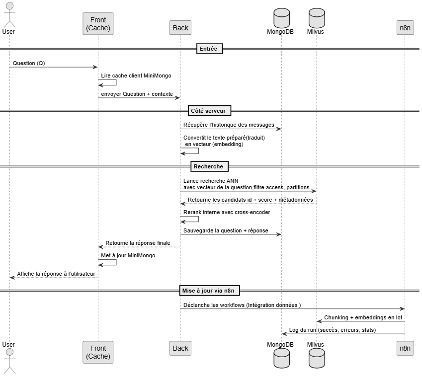
       
      Sequence diagram of the conversational assistant's operation until the Milvus vector database is updated / Diagramme de séquence du fonctionnement de l’assistant conversationnel jusqu’à mise à jour de base vectorielle Milvus
    </td>
  </tr>
</table>
---

## Data Processing Workflow

**EN:**  
Documents and resources are collected from MGMERL, processed through automated ETL pipelines, transformed into structured data, and encoded into vector representations. These vectors are stored in Milvus and queried at runtime to provide contextualized and source-backed answers.

**FR :**  
Les documents et ressources sont collectés depuis MGMERL, traités via des pipelines ETL automatisés, transformés en données structurées puis encodés sous forme de vecteurs. Ces vecteurs sont stockés dans Milvus et interrogés à l’exécution afin de fournir des réponses contextualisées et sourcées.

<table align="center">
<tr>
    <td align="center">
      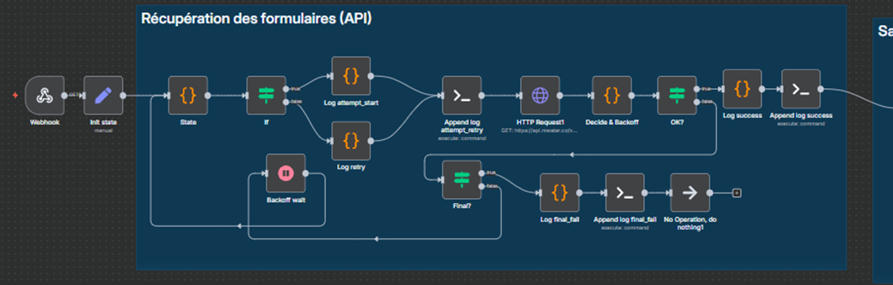
       
      Form Workflow – Step 1: Retrieving Forms / Workflow Formulaire – Étape 1 : Récupération des formulaires
    </td>
    
  </tr>
  <tr>
    <td align="center">
      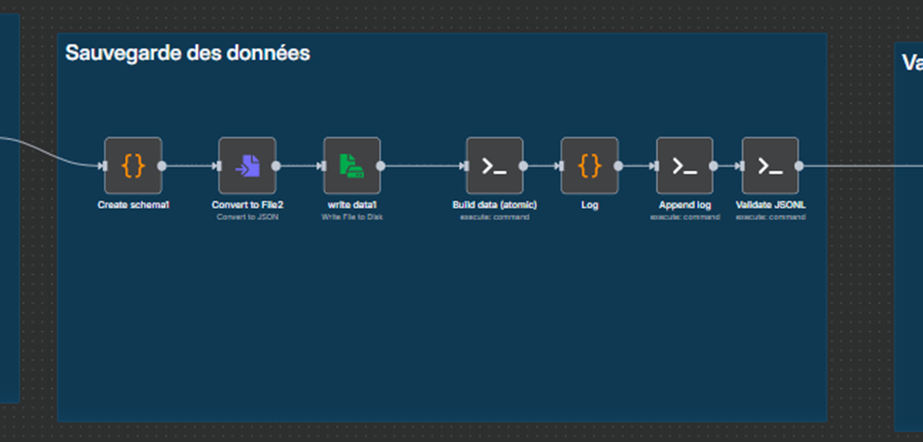
       
      Form Workflow – Step 2: Saving Data / Workflow Formulaire – Étape 2 : Sauvegarde des données
    </td>
    
  </tr>
  <tr>
    <td align="center">
      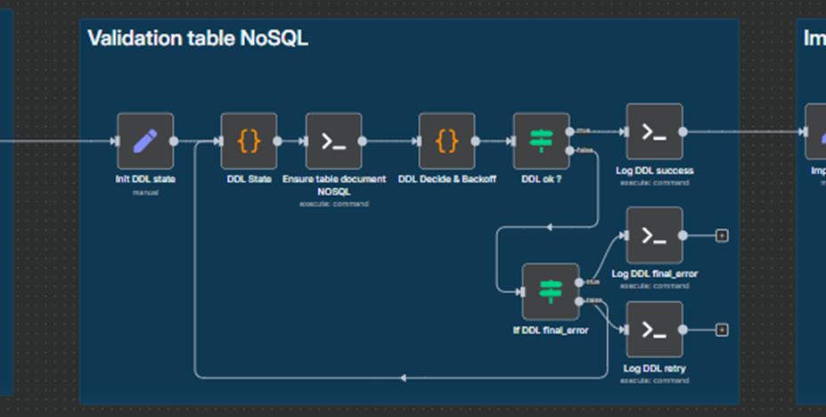
       
      Form Workflow – Step 3: NoSQL table validation / Workflow Formulaire – Étape 3 : Validation table NoSQL
    </td>
  </tr>
  <tr>
    <td align="center">
      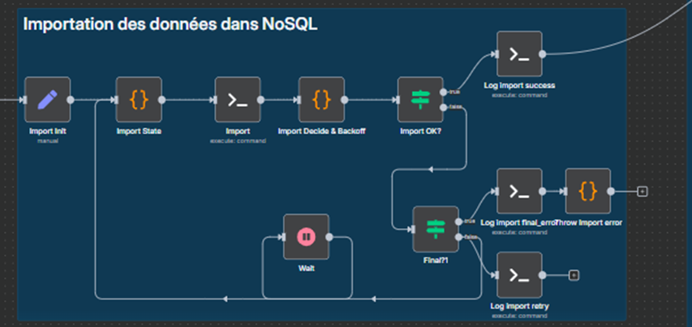
       
      Form Workflow – Step 4: Importing Data into NoSQL / Workflow Formulaire – Étape 4 : Importation des données dans NoSQL
    </td>
  </tr>
  <tr>
    <td align="center">
      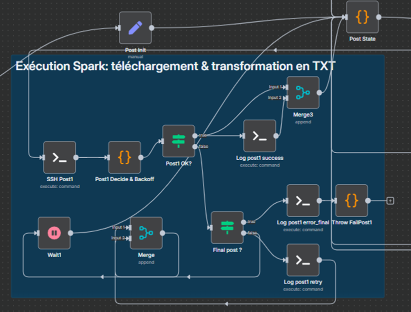
       
      Form Workflow – Step 5: Spark Execution: Transformation / Workflow Formulaire – Étape 5 : Exécution Spark : transformation
    </td>
  </tr>
  <tr>
    <td align="center">
      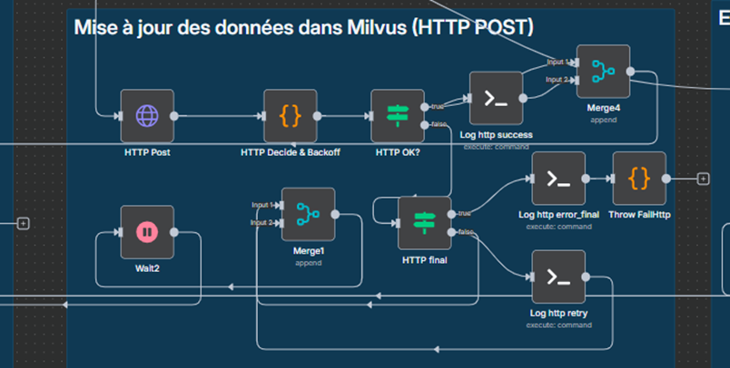
       
      Form Workflow – Step 6: Updating Data in Milvus POST / Workflow Formulaire – Étape 6 : Mise à jour des données dans Milvus POST
    </td>
  </tr>
  <tr>
    <td align="center">
      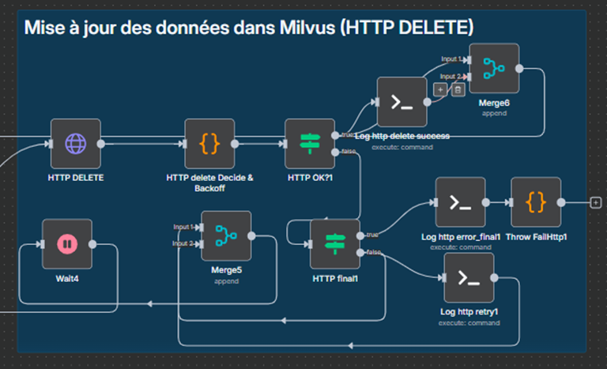
       
      Form Workflow – Step 7: Updating Data in Milvus DELETE / Workflow Formulaire – Étape 7 : Mise à jour des données dans Milvus DELETE
    </td>
  </tr>
  <tr>
    <td align="center">
      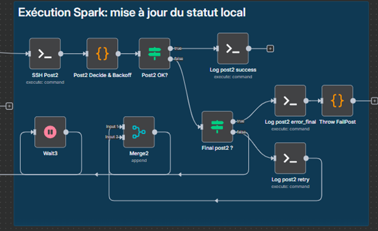
       
      Form Workflow – Step 8: Spark Execution Local Status Update / Workflow Formulaire – Étape 8 : Exécution Spark mise à jour du statut local
    </td>
  </tr>
</table>

---

## Value and Impact

**EN:**  
- Reduced effort required to locate documents and system knowledge  
- Improved user autonomy during training and field operations  
- Increased consistency and reliability of shared information  
- Contribution to the modernization of the MGMERL monitoring and evaluation system  

**FR :**  
- Réduction des efforts nécessaires pour retrouver documents et informations  
- Renforcement de l’autonomie des utilisateurs lors des formations et activités terrain  
- Amélioration de la cohérence et de la fiabilité des informations diffusées  
- Contribution à la modernisation du dispositif de suivi-évaluation MGMERL  

---

## Project Context

**EN:**  
This project was developed as part of an academic and professional internship, with a strong emphasis on software architecture, data modeling, system integration, and user-centered design, under real-world constraints.

The official thesis document for my project can be accessed at the link below.
https://jumpshare.com/share/aydw0o8fCHXxyJHrefFZ

**FR :**  
Ce projet a été réalisé dans le cadre d’un stage académique et professionnel, avec un fort accent sur l’architecture logicielle, la modélisation des données, l’intégration de systèmes et la conception orientée utilisateur, dans un contexte réel et contraint.

Le document officiel de ma thèse est accessible via le lien ci-dessous.
https://jumpshare.com/share/aydw0o8fCHXxyJHrefFZ

---

## Author

**Kaloina Mélodie Anjaniaina RAVOAHANGILALAO**  
Master MBDS – Informatique, Bases de Données et Intégration de Systèmes  

